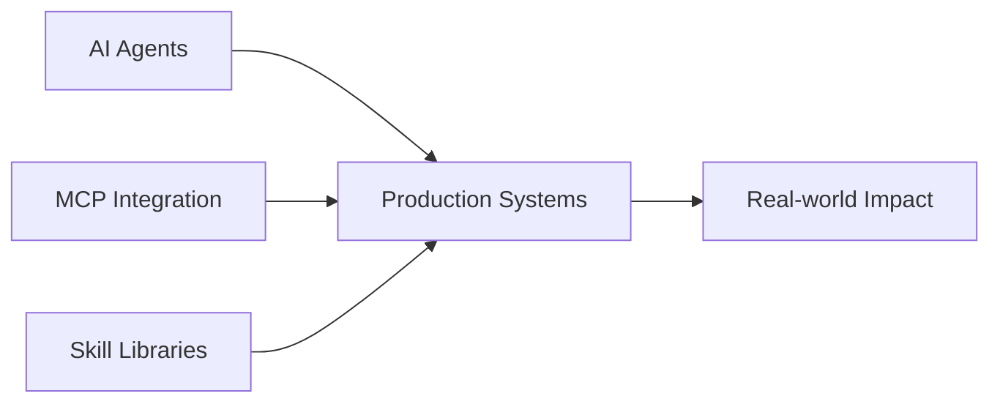

<div align="center">

# 🚀 TRAE Community

**An AI-Native Coding Community**

*Agentic Workflows • System-Level Thinking • Collaborative Engineering*

[](https://github.com/trae-community)
[](https://discord.gg/your-invite)
[](LICENSE)
[](https://twitter.com/trae_community)

[English](#) • [中文](README.zh-CN.md)

</div>

---

## 📖 Table of Contents

- [About TRAE](#-about-trae)
- [Repository Dashboard](#-repository-dashboard)
- [Quick Start](#-quick-start)
- [Featured Projects](#-featured-projects)
- [How to Participate](#-how-to-participate)
- [Community](#-community)
- [Contributors](#-contributors)

---

## 🎯 About TRAE

TRAE (Thoughtful, Reflective, Adaptive Engineering) is a community of builders exploring the frontier of **AI-native software engineering**.

### What We Believe

- 🤖 **AI as a collaborator**, not just a tool
- 🏗️ **System thinking** over feature delivery
- 🌱 **Long-term construction** over short-term output
- 🤝 **Learn by building** together

### Our Focus Areas



---

## 📊 Repository Dashboard

### 🔧 Core Agent & System Practices

| Repository | Description | Status | Activity |
|-----------|-------------|--------|----------|
| [`trae-agents`](https://github.com/trae-community/trae-agents) | AI coding agent design patterns and best practices | 🟢 Active |  |
| [`trae-mcp`](https://github.com/trae-community/trae-mcp) | Model Context Protocol in AI workflows | 🟢 Active |  |
| [`trae-skills`](https://github.com/trae-community/trae-skills) | Reusable execution and control skills | 🟡 Growing |  |

### 📚 Learning & Experiments

| Repository | Description | Status | Activity |
|-----------|-------------|--------|----------|
| [`trae-learning`](https://github.com/trae-community/trae-learning) | Structured learning paths for AI-native development | 🟢 Active |  |
| [`trae-demos`](https://github.com/trae-community/trae-demos) | 50+ runnable demos and real-world case studies | 🟢 Active |  |

### 🤝 Co-creation & Community

| Repository | Description | Status | Activity |
|-----------|-------------|--------|----------|
| [`trae-co-creation-projects`](https://github.com/trae-community/trae-co-creation-projects) | Community-driven collaborative projects | 🟢 Active |  |
| [`discussions`](https://github.com/trae-community/discussions) | Technical discussions and knowledge sharing | 🟢 Active |  |
| [`trae-friends-events`](https://github.com/trae-community/trae-friends-events) | Meetups, workshops, and event archives | 🟡 Growing |  |

### 🎨 Templates & Resources

| Repository | Description | Status | Activity |
|-----------|-------------|--------|----------|
| [`templates`](https://github.com/trae-community/templates) | Production-ready project templates | 🟢 Active |  |
| [`awesome-trae`](https://github.com/trae-community/awesome-trae) | Curated tools, papers, and resources | 🟢 Active |  |

### ⚙️ Governance

| Repository | Description | Status |
|-----------|-------------|--------|
| [`.github`](https://github.com/trae-community/.github) | Contribution guidelines and community rules | 🟢 Maintained |

**Legend**: 🟢 Active | 🟡 Growing | 🔵 Stable | 🟠 Experimental

---

## 🚀 Quick Start

### For Explorers 👀

```bash
# Clone a demo and run it
git clone https://github.com/trae-community/trae-demos
cd trae-demos/getting-started
pip install -r requirements.txt
python demo.py
```

### For Learners 📖

1. Start with [`trae-learning`](https://github.com/trae-community/trae-learning) → Choose your path
2. Follow structured modules → Build hands-on projects
3. Join [`discussions`](https://github.com/trae-community/discussions) → Ask questions

### For Builders 🔨

1. Browse [`trae-co-creation-projects`](https://github.com/trae-community/trae-co-creation-projects)
2. Find a project that interests you
3. Read `CONTRIBUTING.md` and submit your first PR

### For Innovators 💡

1. Use [`templates`](https://github.com/trae-community/templates) → Bootstrap your project
2. Integrate [`trae-skills`](https://github.com/trae-community/trae-skills) → Add AI capabilities
3. Share back with the community

---

## ⭐ Featured Projects

<table>
  <tr>
    <td width="50%">
      <h3>🤖 AutoCoder Agent</h3>
      <p>A production-ready AI coding agent with MCP integration</p>
      <p>
        <a href="https://github.com/trae-community/trae-agents/tree/main/autocoder">
          
        </a>
        
      </p>
    </td>
    <td width="50%">
      <h3>🎯 Skill Orchestrator</h3>
      <p>Dynamic skill composition for complex AI workflows</p>
      <p>
        <a href="https://github.com/trae-community/trae-skills">
          
        </a>
        
      </p>
    </td>
  </tr>
  <tr>
    <td width="50%">
      <h3>📊 AI DevOps Dashboard</h3>
      <p>Observability tools for AI-assisted development</p>
      <p>
        <a href="https://github.com/trae-community/trae-demos/tree/main/devops">
          
        </a>
      </p>
    </td>
    <td width="50%">
      <h3>🎨 Prompt Engineering Lab</h3>
      <p>Interactive playground for prompt optimization</p>
      <p>
        <a href="https://github.com/trae-community/trae-learning/tree/main/prompt-lab">
          
        </a>
      </p>
    </td>
  </tr>
</table>

---

## 🌟 How to Participate

### Entry Philosophy

> **There is no single entry point.**  
> TRAE is a network, not a funnel.

Choose your own adventure:

#### 🔍 **Observer Mode**
- Browse repositories and read code
- Watch demos and explore case studies
- Lurk in discussions and learn from others

#### 🎓 **Learner Mode**
- Follow structured learning paths
- Complete hands-on projects
- Ask questions and get feedback

#### 🛠️ **Builder Mode**
- Pick an active project and contribute
- Fix bugs, add features, improve docs
- Collaborate with other community members

#### 🚀 **Pioneer Mode**
- Start a new co-creation project
- Propose experimental ideas
- Lead a community initiative

### Contribution Areas

<div align="center">

| Area | What You Can Do | Get Started |
|------|----------------|-------------|
| **Code** | Submit PRs, fix bugs, add features | [Contributing Guide](https://github.com/trae-community/.github/blob/main/CONTRIBUTING.md) |
| **Documentation** | Improve docs, write tutorials | [Docs Issues](https://github.com/trae-community/trae-learning/issues?q=is%3Aissue+is%3Aopen+label%3Adocumentation) |
| **Design** | Create diagrams, UI/UX improvements | [Design System](https://github.com/trae-community/templates/tree/main/design) |
| **Testing** | Write tests, report bugs | [Testing Guide](https://github.com/trae-community/.github/blob/main/TESTING.md) |
| **Community** | Answer questions, mentor newcomers | [Discussions](https://github.com/trae-community/discussions) |

</div>

---

## 💬 Community

### Connect With Us

<div align="center">

[](https://discord.gg/your-invite)
[](https://twitter.com/trae_community)
[](https://github.com/orgs/trae-community/discussions)
[](https://trae.substack.com)

</div>

### Community Stats

<div align="center">


</div>

### Events & Meetups

- 📅 **Monthly Office Hours**: First Friday of every month ([Subscribe to calendar](https://calendar.google.com/))
- 🎤 **AI Coding Show & Tell**: Share your projects ([Register here](https://forms.gle/))
- 🏆 **Quarterly Hackathons**: Build with the community ([View upcoming](https://github.com/trae-community/trae-friends-events))

---

## 👥 Contributors

<div align="center">

### Core Team

<!-- Replace with actual team members -->
<!-- <a href="https://github.com/member1"></a>
<a href="https://github.com/member2"></a>
<a href="https://github.com/member3"></a> -->

### Community Contributors

<a href="https://github.com/trae-community/.github/graphs/contributors">
  
</a>

**[Become a contributor →](https://github.com/trae-community/.github/blob/main/CONTRIBUTING.md)**

</div>

---

## 📜 License

Most TRAE repositories are licensed under [MIT License](LICENSE), unless specified otherwise.

---

## 🗺️ Roadmap

### 2026 Q1-Q2 Focus
- [ ] Launch MCP integration framework v2.0
- [ ] 100+ community demos and case studies
- [ ] AI coding certification program
- [ ] Enterprise adoption toolkit

[View full roadmap →](https://github.com/orgs/trae-community/projects)

---

## ⚡ Quick Links

- [🏠 Community Home](https://trae.community)
- [📚 Documentation](https://docs.trae.community)
- [🎓 Learning Portal](https://learn.trae.community)
- [💼 Jobs Board](https://jobs.trae.community)
- [🛠️ Tool Directory](https://tools.trae.community)

---

<div align="center">

**Built with 🤖 by humans who believe in AI collaboration**

[](https://star-history.com/#trae-community/.github)

*TRAE values long-term construction over short-term output.*

</div>
