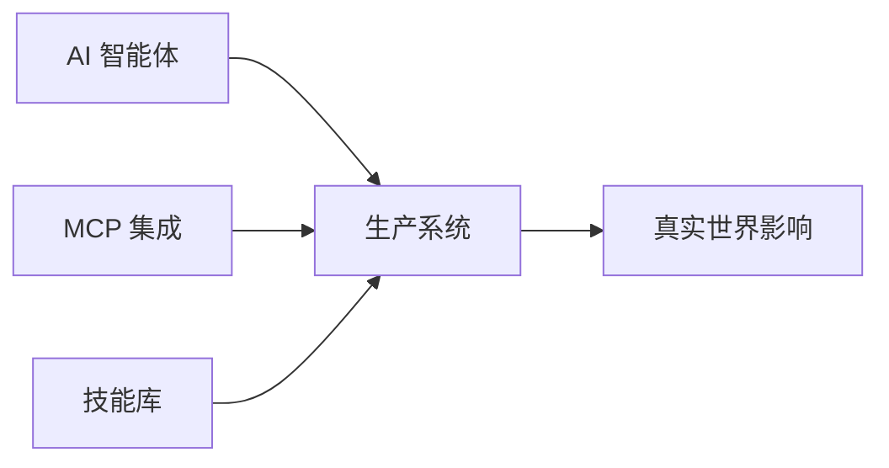

<div align="center">

# 🚀 TRAE 社区

**AI 原生编码社区**

*智能体工作流 • 系统级思维 • 协作工程*

[](https://github.com/trae-community)
[](https://discord.gg/your-invite)
[](LICENSE)
[](https://twitter.com/trae_community)

[English](README.md) • [中文](#)

</div>

---

## 📖 目录

- [关于 TRAE](#-关于-trae)
- [仓库导航](#-仓库导航)
- [快速开始](#-快速开始)
- [特色项目](#-特色项目)
- [如何参与](#-如何参与)
- [社区](#-社区)
- [贡献者](#-贡献者)

---

## 🎯 关于 TRAE

TRAE（Thoughtful, Reflective, Adaptive Engineering，深思、反思、适应性工程）是一个探索 **AI 原生软件工程**前沿的建设者社区。

### 我们的信念

- 🤖 **AI 是协作者**，而非仅仅是工具
- 🏗️ **系统思维**优于功能交付
- 🌱 **长期建设**优于短期产出
- 🤝 **在构建中学习**，共同成长

### 我们的关注领域



---

## 📊 仓库导航

### 🔧 核心智能体与系统实践

| 仓库 | 描述 | 状态 | 活跃度 |
|-----------|-------------|--------|----------|
| [`trae-agents`](https://github.com/trae-community/trae-agents) | AI 编码智能体设计模式和最佳实践 | 🟢 活跃 |  |
| [`trae-mcp`](https://github.com/trae-community/trae-mcp) | AI 工作流中的模型上下文协议（MCP）实践 | 🟢 活跃 |  |
| [`trae-skills`](https://github.com/trae-community/trae-skills) | 可复用的执行和控制技能库 | 🟡 成长中 |  |

### 📚 学习与实验

| 仓库 | 描述 | 状态 | 活跃度 |
|-----------|-------------|--------|----------|
| [`trae-learning`](https://github.com/trae-community/trae-learning) | AI 原生开发的结构化学习路径 | 🟢 活跃 |  |
| [`trae-demos`](https://github.com/trae-community/trae-demos) | 50+ 可运行的演示和真实案例研究 | 🟢 活跃 |  |

### 🤝 共创与社区

| 仓库 | 描述 | 状态 | 活跃度 |
|-----------|-------------|--------|----------|
| [`trae-co-creation-projects`](https://github.com/trae-community/trae-co-creation-projects) | 社区驱动的协作项目 | 🟢 活跃 |  |
| [`discussions`](https://github.com/trae-community/discussions) | 技术讨论和知识分享 | 🟢 活跃 |  |
| [`trae-friends-events`](https://github.com/trae-community/trae-friends-events) | 线下聚会、工作坊和活动档案 | 🟡 成长中 |  |

### 🎨 模板与资源

| 仓库 | 描述 | 状态 | 活跃度 |
|-----------|-------------|--------|----------|
| [`templates`](https://github.com/trae-community/templates) | 生产就绪的项目模板 | 🟢 活跃 |  |
| [`awesome-trae`](https://github.com/trae-community/awesome-trae) | 精选工具、论文和资源 | 🟢 活跃 |  |

### ⚙️ 治理

| 仓库 | 描述 | 状态 |
|-----------|-------------|--------|
| [`.github`](https://github.com/trae-community/.github) | 贡献指南和社区规则 | 🟢 维护中 |

**图例**: 🟢 活跃 | 🟡 成长中 | 🔵 稳定 | 🟠 实验性

---

## 🚀 快速开始

### 探索者 👀

```bash
# 克隆一个演示项目并运行
git clone https://github.com/trae-community/trae-demos
cd trae-demos/getting-started
pip install -r requirements.txt
python demo.py
```

### 学习者 📖

1. 从 [`trae-learning`](https://github.com/trae-community/trae-learning) 开始 → 选择你的学习路径
2. 跟随结构化模块 → 构建实践项目
3. 加入 [`discussions`](https://github.com/trae-community/discussions) → 提问交流

### 建设者 🔨

1. 浏览 [`trae-co-creation-projects`](https://github.com/trae-community/trae-co-creation-projects)
2. 找到你感兴趣的项目
3. 阅读 `CONTRIBUTING.md` 并提交你的第一个 PR

### 创新者 💡

1. 使用 [`templates`](https://github.com/trae-community/templates) → 快速启动你的项目
2. 集成 [`trae-skills`](https://github.com/trae-community/trae-skills) → 添加 AI 能力
3. 将成果分享回社区

---

## ⭐ 特色项目

<table>
  <tr>
    <td width="50%">
      <h3>🤖 AutoCoder 智能体</h3>
      <p>集成 MCP 的生产就绪 AI 编码智能体</p>
      <p>
        <a href="https://github.com/trae-community/trae-agents/tree/main/autocoder">
          
        </a>
        
      </p>
    </td>
    <td width="50%">
      <h3>🎯 技能编排器</h3>
      <p>用于复杂 AI 工作流的动态技能组合系统</p>
      <p>
        <a href="https://github.com/trae-community/trae-skills">
          
        </a>
        
      </p>
    </td>
  </tr>
  <tr>
    <td width="50%">
      <h3>📊 AI DevOps 仪表板</h3>
      <p>AI 辅助开发的可观测性工具</p>
      <p>
        <a href="https://github.com/trae-community/trae-demos/tree/main/devops">
          
        </a>
      </p>
    </td>
    <td width="50%">
      <h3>🎨 提示词工程实验室</h3>
      <p>提示词优化的交互式游乐场</p>
      <p>
        <a href="https://github.com/trae-community/trae-learning/tree/main/prompt-lab">
          
        </a>
      </p>
    </td>
  </tr>
</table>

---

## 🌟 如何参与

### 进入哲学

> **没有单一的入口。**  
> TRAE 是一个网络，而非漏斗。

选择你自己的冒险：

#### 🔍 **观察者模式**
- 浏览仓库，阅读代码
- 观看演示，探索案例研究
- 潜水讨论区，向他人学习

#### 🎓 **学习者模式**
- 跟随结构化学习路径
- 完成实践项目
- 提问并获得反馈

#### 🛠️ **建设者模式**
- 选择一个活跃项目并贡献
- 修复 bug、添加功能、改进文档
- 与其他社区成员协作

#### 🚀 **先锋者模式**
- 启动一个新的共创项目
- 提出实验性想法
- 领导社区倡议

### 贡献领域

<div align="center">

| 领域 | 你可以做什么 | 开始 |
|------|----------------|-------------|
| **代码** | 提交 PR、修复 bug、添加功能 | [贡献指南](https://github.com/trae-community/.github/blob/main/CONTRIBUTING.md) |
| **文档** | 改进文档、编写教程 | [文档 Issues](https://github.com/trae-community/trae-learning/issues?q=is%3Aissue+is%3Aopen+label%3Adocumentation) |
| **设计** | 创建图表、UI/UX 改进 | [设计系统](https://github.com/trae-community/templates/tree/main/design) |
| **测试** | 编写测试、报告 bug | [测试指南](https://github.com/trae-community/.github/blob/main/TESTING.md) |
| **社区** | 回答问题、指导新人 | [讨论区](https://github.com/trae-community/discussions) |

</div>

---

## 💬 社区

### 联系我们

<div align="center">

[](https://discord.gg/your-invite)
[](https://twitter.com/trae_community)
[](https://github.com/orgs/trae-community/discussions)
[](https://trae.substack.com)

</div>

### 社区统计

<div align="center">


</div>

### 活动与聚会

- 📅 **月度办公时间**: 每月第一个周五 ([订阅日历](https://calendar.google.com/))
- 🎤 **AI 编码展示与分享**: 分享你的项目 ([立即注册](https://forms.gle/))
- 🏆 **季度黑客松**: 与社区一起构建 ([查看即将举办的活动](https://github.com/trae-community/trae-friends-events))

---

## 👥 贡献者

<div align="center">

### 核心团队

<!-- 替换为实际团队成员 -->
<a href="https://github.com/member1"></a>
<a href="https://github.com/member2"></a>
<a href="https://github.com/member3"></a>

### 社区贡献者

<a href="https://github.com/trae-community/.github/graphs/contributors">
  
</a>

**[成为贡献者 →](https://github.com/trae-community/.github/blob/main/CONTRIBUTING.md)**

</div>

---

## 📜 许可证

大多数 TRAE 仓库采用 [MIT 许可证](LICENSE)，除非另有说明。

---

## 🗺️ 路线图

### 2026 年 Q1-Q2 重点

- [ ] 发布 MCP 集成框架 v2.0
- [ ] 100+ 社区演示和案例研究
- [ ] AI 编码认证计划
- [ ] 企业采用工具包

[查看完整路线图 →](https://github.com/orgs/trae-community/projects)

---

## ⚡ 快速链接

- [🏠 社区主页](https://trae.community)
- [📚 文档中心](https://docs.trae.community)
- [🎓 学习门户](https://learn.trae.community)
- [💼 工作板](https://jobs.trae.community)
- [🛠️ 工具目录](https://tools.trae.community)

---

<div align="center">

**由相信 AI 协作的人类用 🤖 构建**

[](https://star-history.com/#trae-community/.github)

*TRAE 重视长期建设，而非短期产出。*

</div>
